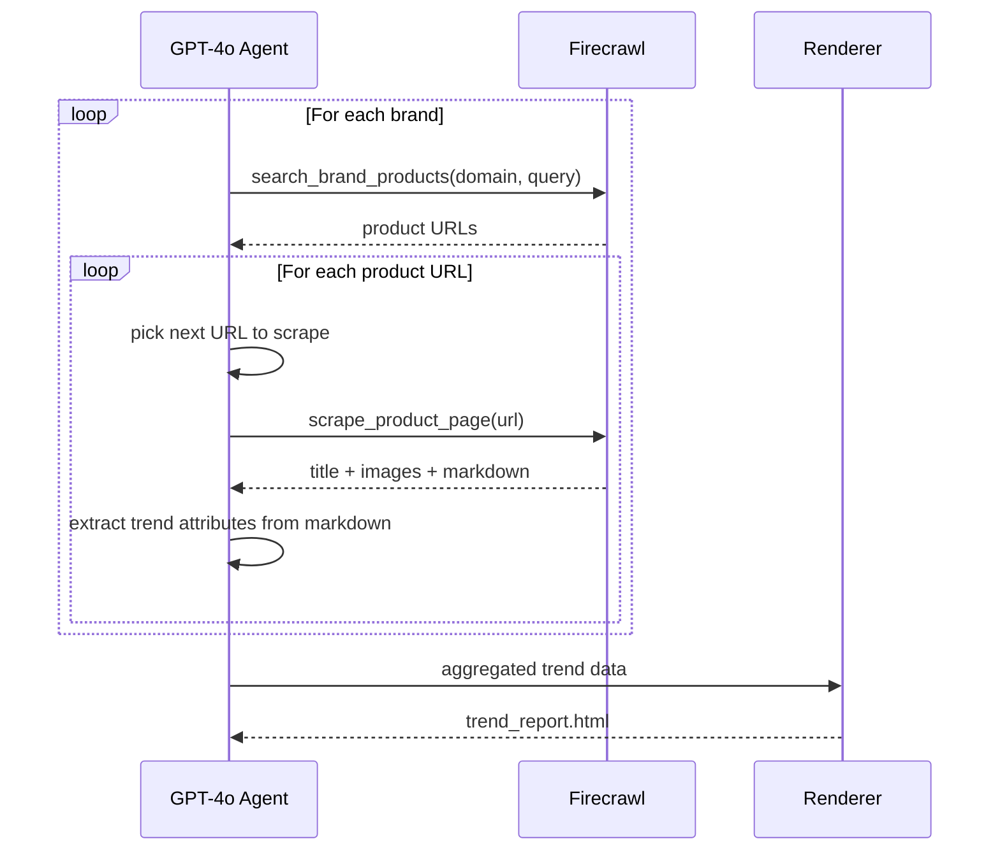

# Fashion Trend Intelligence Agent

An agentic pipeline that crawls apparel brand websites (Zara, Bershka, H&M), extracts structured fashion trend data, and renders a visual HTML report with product images.

## How It Works



**GPT-4o** drives the agentic loop — it decides which URLs to scrape, skips 404s, varies search queries for diverse category coverage, and extracts structured trend attributes (fit, fabric, silhouette, print, pattern, color, etc.) from scraped page content.

**Firecrawl** handles web access — JS rendering, scraping, and web search for product discovery on sites that block traditional crawlers.

## Architecture

```
agent/
├── orchestrator.py   # Agentic loop — GPT-4o with tool calling
├── tools.py          # Firecrawl wrappers (search + scrape)
├── models.py         # Pydantic data models
├── aggregator.py     # Cross-brand trend frequency analysis
└── renderer.py       # Jinja2 HTML report renderer
templates/
└── report.html.j2    # Dark-mode report template
config.py             # Brand configs + env var loading
main.py               # Entry point
```

## Setup

```bash
python -m venv .venv
source .venv/bin/activate
pip install firecrawl openai jinja2 pydantic
```

## Configuration

Copy the example env file and add your keys:

```bash
cp .env.example .env
```

```
FIRECRAWL_API_KEY=fc-your-key-here
OPENAI_API_KEY=sk-your-key-here
OPENAI_MODEL=gpt-4o          # optional, defaults to gpt-4o
```

Get API keys from:
- Firecrawl: https://firecrawl.dev
- OpenAI: https://platform.openai.com/api-keys

## Usage

```bash
source .env
python main.py
```

The agent will:
1. Crawl each brand (Zara, Bershka, H&M) via Firecrawl web search + scrape
2. Extract trend attributes using GPT-4o's in-context analysis
3. Aggregate trends across brands
4. Generate `output/trend_report.html` and open it in your browser

## Extracted Trend Attributes

| Attribute | Examples |
|---|---|
| Fit | slim, oversized, relaxed, tailored, boxy |
| Silhouette | A-line, bodycon, straight, flared, wrap |
| Fabric | linen, denim, chiffon, cotton, satin |
| Prints & Patterns | floral, stripes, abstract, solid, plaid |
| Colors | ivory, cobalt blue, terracotta, black |
| Length | mini, midi, maxi, cropped |
| Neckline | V-neck, off-shoulder, crew, square, halter |
| Sleeve Style | sleeveless, puff, balloon, cap, long |
| Details | cutout, ruching, pleats, embroidery |

## Adding New Brands

Edit `config.py`:

```python
BrandConfig(
    name="Mango",
    domain="mango.com",
    new_arrivals_path="/en/women/new-arrivals",
    categories=["dresses", "tops", "trousers"],
    max_pages=20,
)
```

## Design Docs

- [High Level Design](docs/HLD.md)
- [Low Level Design](docs/LLD.md)
