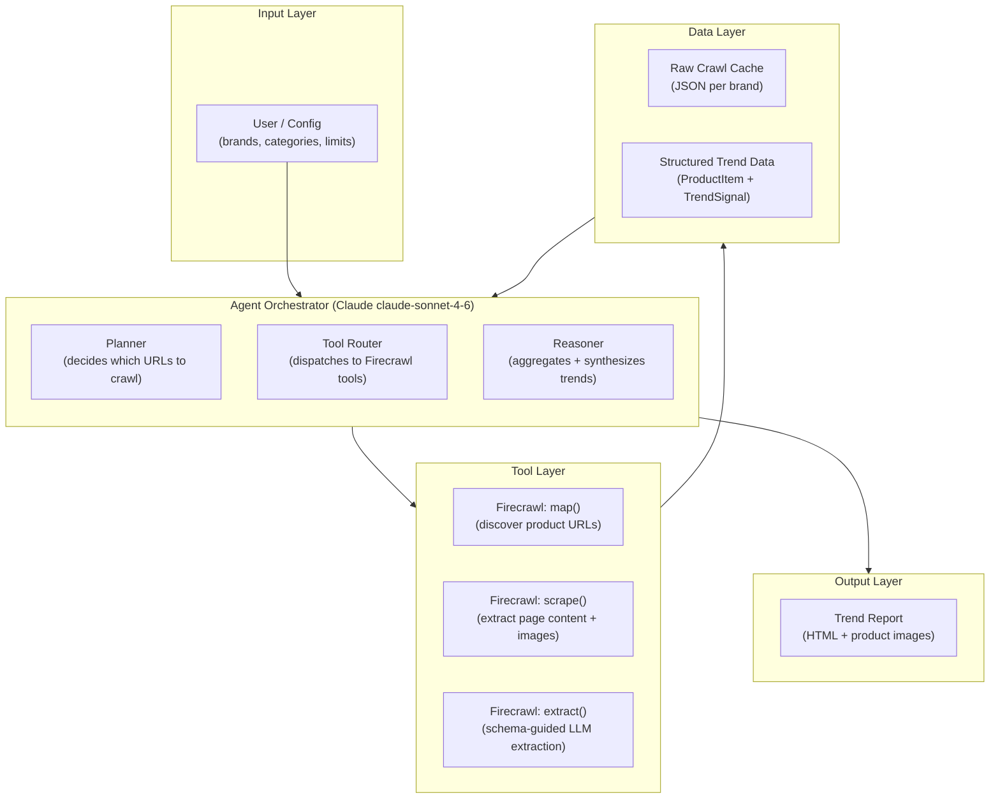
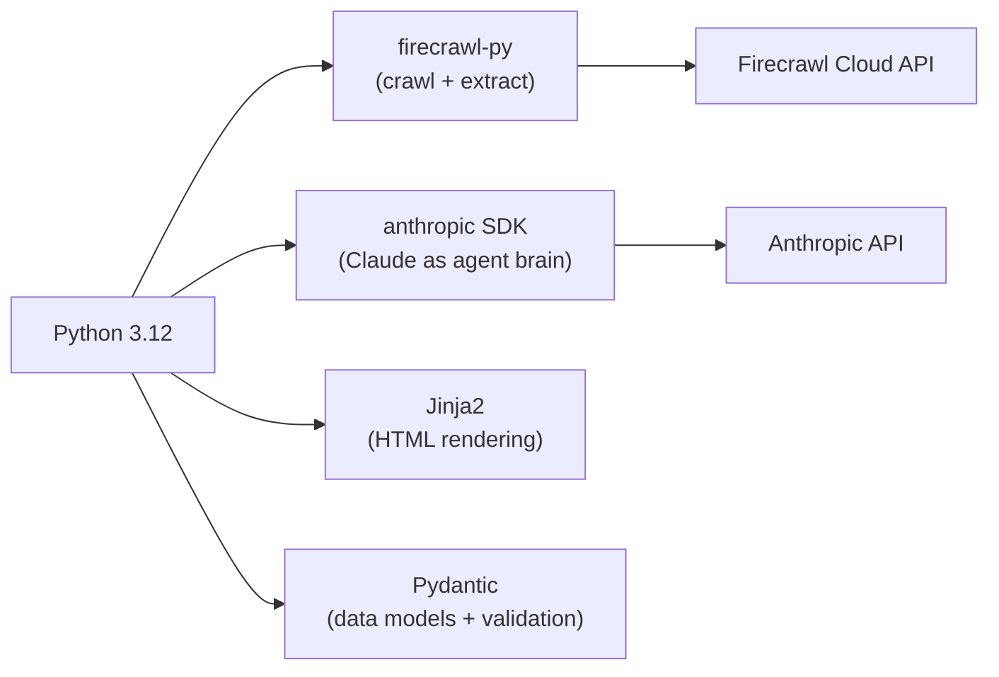
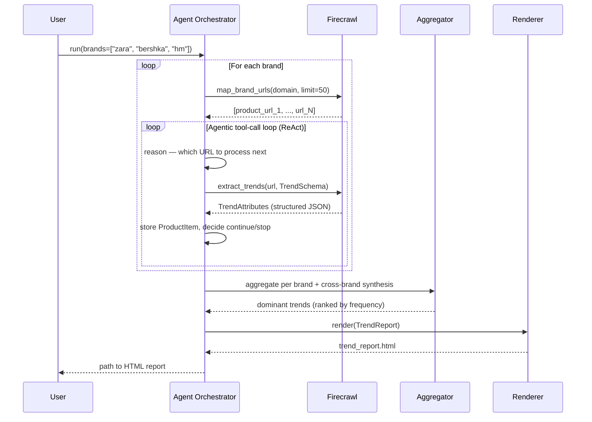
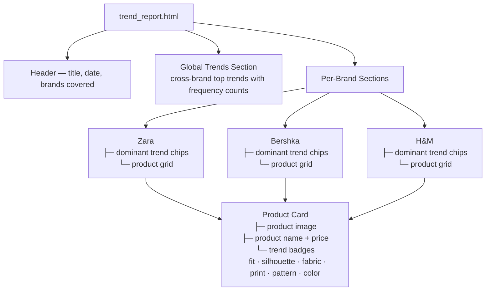

# Fashion Trend Intelligence Agent — High Level Design (HLD)

## 1. System Overview

An agentic pipeline that crawls apparel brand websites (Zara, Bershka, H&M), extracts structured fashion trend data (fit, fabric, silhouette, print, pattern, etc.), and renders a visual HTML report with product images.

The agent uses **Claude** as the reasoning core and **Firecrawl** as the web access layer. It follows a **ReAct** (Reason + Act) pattern: plan → crawl → extract → aggregate → render.

---

## 2. High-Level Architecture

---

## 3. Component Responsibilities

| Component | Responsibility |
|---|---|
| **Agent Orchestrator** | Agentic loop — plan, call tools, observe results, iterate until done |
| **Firecrawl `map()`** | Discover all product/collection URLs under a brand domain |
| **Firecrawl `scrape()`** | Pull full page markdown + image URLs from product pages |
| **Firecrawl `extract()`** | Schema-guided structured extraction of trend attributes via LLM |
| **Trend Aggregator** | Cross-brand synthesis — identify dominant trends by frequency |
| **HTML Renderer** | Jinja2 template → styled report with product images and trend badges |

---

## 4. Technology Stack

| Library | Version | Purpose |
|---|---|---|
| `firecrawl-py` | latest | Web crawling, scraping, structured extraction |
| `anthropic` | latest | Claude claude-sonnet-4-6 as agent reasoning core |
| `pydantic` | v2 | Data model validation and schema generation |
| `jinja2` | latest | HTML report templating |
| `asyncio` | stdlib | Concurrent brand crawling |

---

## 5. End-to-End Data Flow

---

## 6. HTML Output Structure

---

## 7. Key Design Decisions

| Decision | Choice | Rationale |
|---|---|---|
| Agent brain | Claude claude-sonnet-4-6 via tool use API | Best structured extraction + multi-step reasoning |
| Extraction strategy | `firecrawl.extract()` with Pydantic schema | Avoids brittle CSS selectors, handles JS-rendered pages |
| URL discovery | `firecrawl.map()` scoped to `/new-arrivals` or `/woman` | Targeted crawl, avoids crawling entire site |
| Trend aggregation | Counter-based frequency per attribute | Simple, interpretable, no extra ML dependency |
| HTML rendering | Jinja2 template | Clean separation of data logic and presentation |
| Concurrency | `asyncio` + batched scraping per brand | Respects rate limits while maximising speed |

---

## 8. System Constraints & Boundaries

- **Scope**: New arrivals and current season collections only — not full site crawl
- **Rate limiting**: Max 50 product pages per brand per run (configurable)
- **Images**: Referenced by URL in HTML — not downloaded locally
- **Authentication**: No login required; only publicly accessible product pages
- **Output**: Single self-contained HTML file written to `output/trend_report.html`
