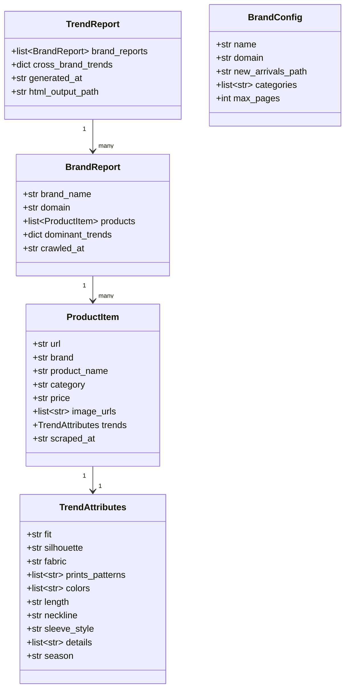
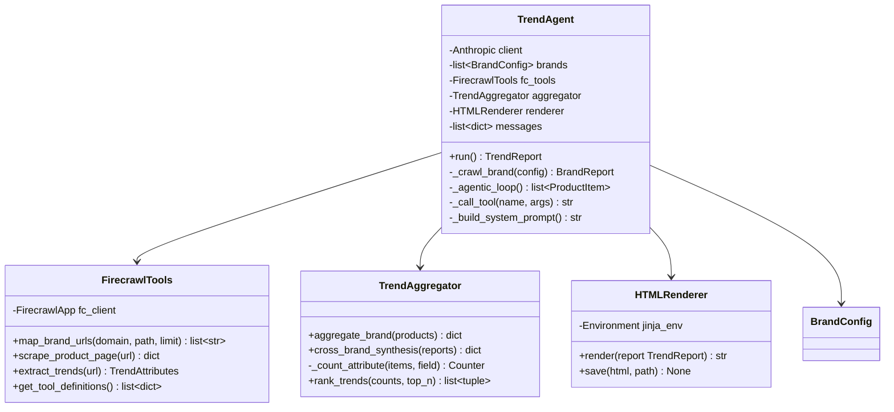
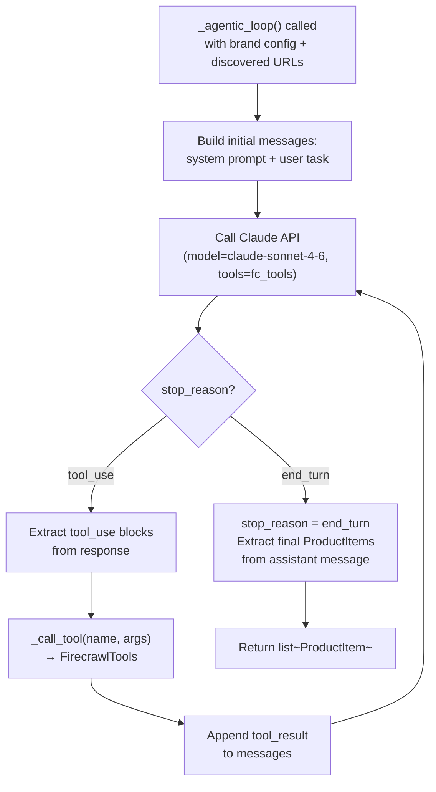
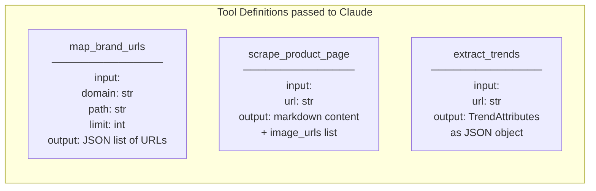
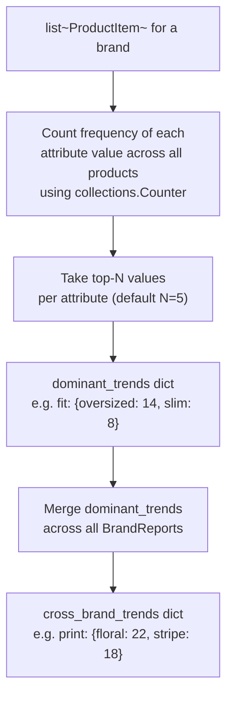
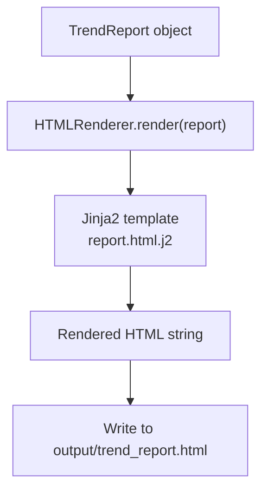
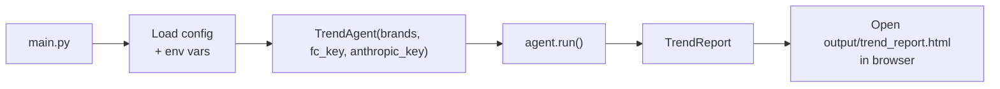
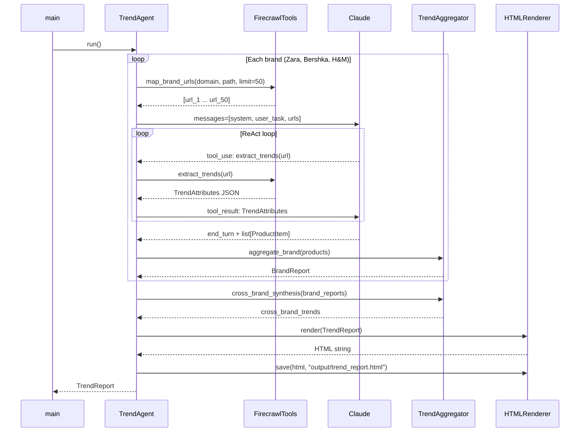

# Fashion Trend Intelligence Agent — Low Level Design (LLD)

## 1. File Structure

```
firecrawl-test/
├── agent/
│   ├── __init__.py
│   ├── orchestrator.py       # TrendAgent + agentic loop
│   ├── tools.py              # FirecrawlTools (map, scrape, extract)
│   ├── models.py             # Pydantic models
│   ├── aggregator.py         # TrendAggregator
│   └── renderer.py           # HTMLRenderer + Jinja2 template
├── templates/
│   └── report.html.j2        # Jinja2 HTML template
├── docs/
│   ├── HLD.md
│   └── LLD.md
├── output/
│   └── trend_report.html     # Generated output (gitignored)
├── config.py                 # Brand configs, API keys
├── main.py                   # Entry point
└── test.py                   # Existing Firecrawl smoke test
```

---

## 2. Data Models (`agent/models.py`)



### Model Definitions

```python
# agent/models.py

class TrendAttributes(BaseModel):
    fit: str | None                    # e.g. "slim", "oversized", "relaxed"
    silhouette: str | None             # e.g. "A-line", "bodycon", "boxy"
    fabric: str | None                 # e.g. "linen", "denim", "chiffon"
    prints_patterns: list[str]         # e.g. ["floral", "stripes", "abstract"]
    colors: list[str]                  # e.g. ["ecru", "cobalt blue", "terracotta"]
    length: str | None                 # e.g. "midi", "mini", "cropped"
    neckline: str | None               # e.g. "V-neck", "off-shoulder", "crew"
    sleeve_style: str | None           # e.g. "puff", "sleeveless", "balloon"
    details: list[str]                 # e.g. ["cutout", "ruching", "embroidery"]
    season: str | None                 # e.g. "SS25", "AW25"

class ProductItem(BaseModel):
    url: str
    brand: str
    product_name: str
    category: str | None
    price: str | None
    image_urls: list[str]
    trends: TrendAttributes
    scraped_at: str                    # ISO 8601

class BrandReport(BaseModel):
    brand_name: str
    domain: str
    products: list[ProductItem]
    dominant_trends: dict              # {"fit": {"oversized": 12, ...}, ...}
    crawled_at: str

class TrendReport(BaseModel):
    brand_reports: list[BrandReport]
    cross_brand_trends: dict           # aggregated across all brands
    generated_at: str
    html_output_path: str
```

---

## 3. Class Design



---

## 4. Agentic Loop Detail (`agent/orchestrator.py`)

The core loop follows the **ReAct** pattern: the agent reasons about what to do next, calls a tool, observes the result, and repeats until it decides to stop.



### Agent System Prompt (key instructions)

```
You are a fashion trend analyst agent. You have access to three tools:
- map_brand_urls: discover product URLs for a brand
- scrape_product_page: get raw content + images from a product URL
- extract_trends: extract structured trend attributes from a product URL

For each brand, you will:
1. Map product URLs from the new arrivals section
2. Select the most trend-representative products (aim for 20-30)
3. Extract structured trend data for each product
4. Return a JSON list of ProductItem objects

Focus on: fit, silhouette, fabric, prints/patterns, colors, length, neckline, sleeve style, details.
```

---

## 5. Firecrawl Tool Definitions (`agent/tools.py`)

### Tools registered with Claude (tool use API format)



### Tool Dispatch Logic

```python
# agent/tools.py

def map_brand_urls(self, domain: str, path: str, limit: int) -> list[str]:
    result = self.fc_client.map(f"https://{domain}{path}", limit=limit)
    return result.links

def scrape_product_page(self, url: str) -> dict:
    result = self.fc_client.scrape_url(url, formats=["markdown"])
    return {
        "content": result.markdown,
        "image_urls": result.metadata.get("og:image", [])
    }

def extract_trends(self, url: str) -> dict:
    result = self.fc_client.extract(
        [url],
        prompt="Extract fashion trend attributes from this product page.",
        schema=TrendAttributes.model_json_schema()
    )
    return result[0]  # TrendAttributes as dict
```

---

## 6. Trend Aggregation (`agent/aggregator.py`)



### Aggregation Output Example

```json
{
  "fit": {"oversized": 14, "relaxed": 9, "slim": 6},
  "silhouette": {"boxy": 11, "A-line": 8},
  "fabric": {"linen": 13, "denim": 10, "chiffon": 7},
  "prints_patterns": {"floral": 18, "stripes": 12, "abstract": 5},
  "colors": {"ecru": 16, "cobalt blue": 11, "terracotta": 9}
}
```

---

## 7. HTML Renderer (`agent/renderer.py` + `templates/report.html.j2`)



### Template Sections

| Section | Data Source | Notes |
|---|---|---|
| Header | `TrendReport.generated_at` | Title, date, brands list |
| Global Trends | `TrendReport.cross_brand_trends` | Bar-style chips sorted by frequency |
| Brand Section × 3 | `BrandReport` | Brand name, dominant trends, product grid |
| Product Card | `ProductItem` | Image, name, price, trend attribute badges |

---

## 8. Configuration (`config.py`)

```python
BRANDS = [
    BrandConfig(
        name="Zara",
        domain="zara.com",
        new_arrivals_path="/en/in/woman-new-in",
        categories=["dresses", "tops", "trousers"],
        max_pages=30,
    ),
    BrandConfig(
        name="Bershka",
        domain="bershka.com",
        new_arrivals_path="/en/woman/new-collection",
        categories=["dresses", "tops", "jeans"],
        max_pages=30,
    ),
    BrandConfig(
        name="H&M",
        domain="hm.com",
        new_arrivals_path="/en_in/women/new-arrivals",
        categories=["dresses", "tops", "trousers"],
        max_pages=30,
    ),
]
```

---

## 9. Entry Point (`main.py`)



---

## 10. Error Handling Strategy

| Failure Point | Strategy |
|---|---|
| Firecrawl rate limit (429) | Exponential backoff with jitter, max 3 retries |
| Firecrawl returns empty page | Skip URL, log warning, continue |
| Claude tool call malformed args | Validate with Pydantic before dispatch, return error string to agent |
| Extraction returns null fields | `TrendAttributes` fields are all `Optional` — nulls are allowed |
| Brand site blocks crawl | Log error per brand, continue with remaining brands |

---

## 11. Sequence: Full Run


